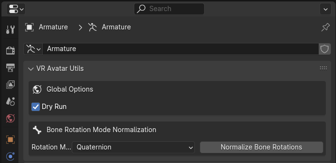
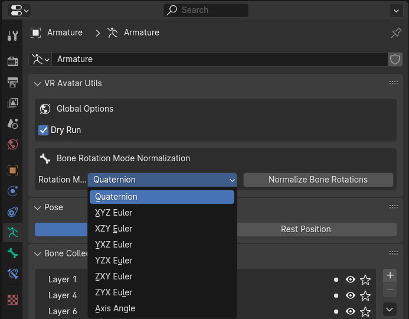
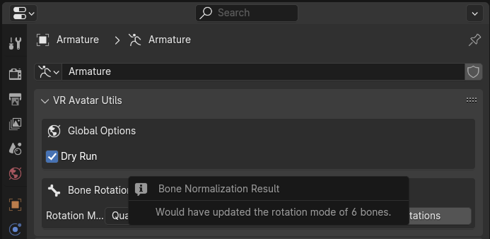
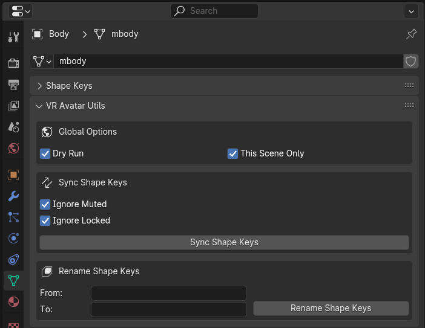
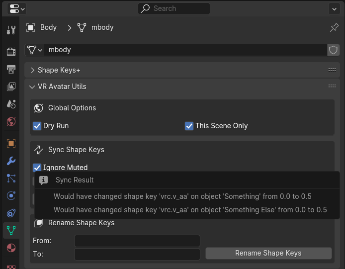
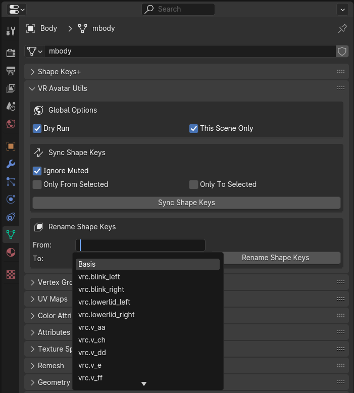
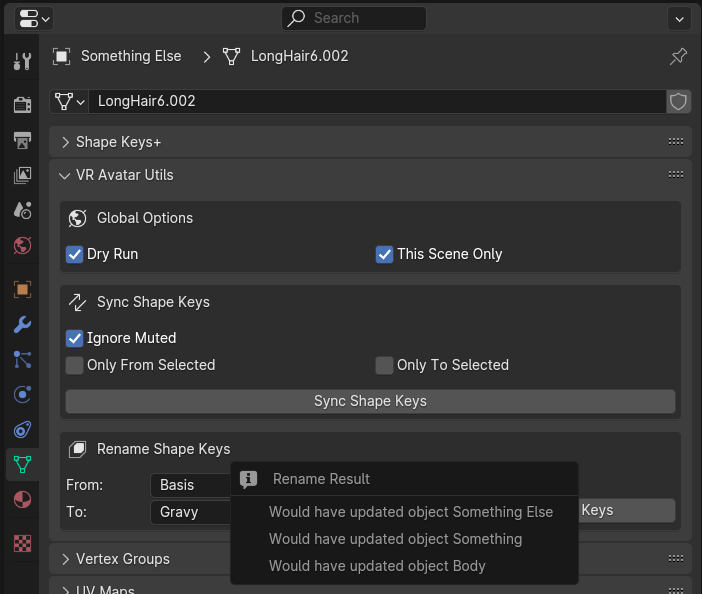
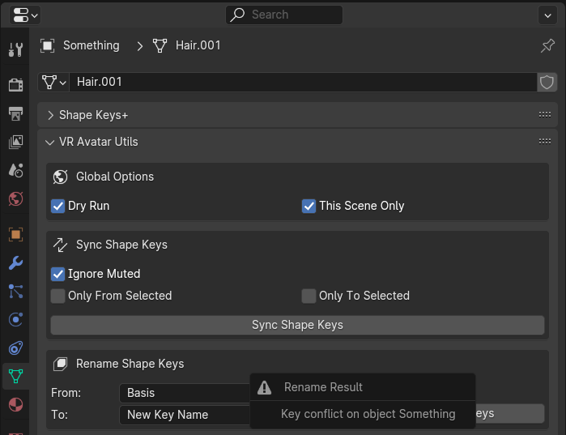
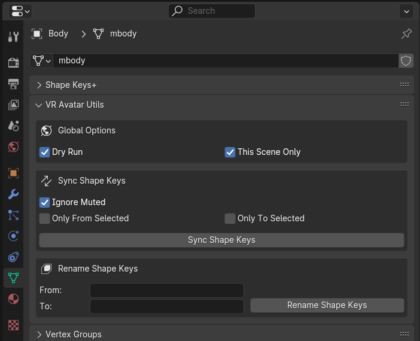

= VR Avatar Utils - v0.1.0
:stylesdir: ../common/css
:stylesheet: slate.css
:icons: font
:icon-set: fas
:toc: left
:link-skp: https://github.com/MichaelGlenMontague/shape_keys_plus[Shape Keys+]
:abbr-vau: pass:[<abbr title="VR Avatar Utils">VAU</abbr>]
// :toclevels: 3

The following documents the options and features included in the VR Avatar Utils
({abbr-vau}) Blender addon.

== Armatures

=== Bone Rotation Mode Normalization

Normalizes the transform rotation mode on all bones in an armature to the chosen
mode value.

[TIP]
--
Why?::
When applying poses from assets or from other armatures, having bones with
conflicting rotation modes can lead to the pose being applied incorrectly.
+
Frequently when an avatar base has a small number of bones with a different
rotation mode than the rest, it was unintentional.
--

.Base UI

==== Options

.Global Options
--
[%header, cols='2,1,7']
|===
| Option | Type | Description

| Dry Run
| Toggle
| Sets whether the addon should perform a dry run on execution.  This means,
when enabled, that the addon will not actually change anything and will instead
report the changes that it wanted to make.

It is recommended that operations are first performed with Dry Run enabled to
ensure that all the changes that would be made are desired.
|===
--

.Feature Options
--
[%header, cols='2,1,7']
|===
| Option | Type | Description

| Rotation Mode
| Dropdown
| Chooses the rotation mode that will be set on all the bones in the armature.

These options align with the modes outlined in
https://docs.blender.org/manual/en/latest/advanced/appendices/rotations.html[the Blender documentation].
|===
--

.Rotation Mode Options

.Result Details

== Meshes

.Mesh Operations

=== Shape Key Value Synchronization

Synchronizes the values of shape keys from a source mesh object to matching
shape keys on all other mesh objects in the scene or file.

Shape keys are matched on name, meaning only shape keys with a name matching a
shape key on the source object will be updated on a target object.  This
feature does not add or remove shape keys.

[TIP]
--
Why?::
This may come in handy while working on accessories for an avatar base that have
shape keys to match morphs available on the base.  For example, when creating a
shirt for an avatar that has height/weight options, this enables easily updating
the accessory to match those morphs on the base.

Can't you use drivers for this?::
You can, however, I have found that the time and effort cost of setting up
drivers outweighs the benefit for small scale work such as modding an avatar.
--

==== Options

.Global Options
--
[%header, cols='2,1,7']
|===
| Option | Type | Description

| Dry Run
| Toggle
| Sets whether the addon should perform a dry run on execution.  This means,
when enabled, that the addon will not actually change anything and will instead
report the changes that it wanted to make.

It is recommended that operations are first performed with Dry Run enabled to
ensure that all the changes that would be made are desired.

| This Scene Only
| Toggle
| Sets whether the shape key synchronization should only apply to mesh objects
in the current scene, or all mesh objects in the file.
|===
--

.Feature Options
--
[%header, cols='2,1,7']
|===
| Option | Type | Description

| Ignore Muted
| Toggle
| Sets whether the addon should ignore shape keys on the source object that are
marked as muted.

| Ignore Locked
| Toggle
| Sets whether the addon should ignore shape keys on target mesh object that are
marked as locked.
|===

[IMPORTANT]
The options outlined in the Feature Options table above differ from the options
present when the {link-skp} addon is also installed and enabled.  See the
<<key-sync-integration-skp,Integrations>> section below for information about
the options specific to Shape Keys+.
--

.Operation Results

=== Shape Key Bulk Renaming

Renames shape keys on all mesh objects in the scene or blend file that have a
name that is an exact match for the set 'From' value.

==== Options

.Global Options
--
[%header, cols='2,1,7']
|===
| Option | Type | Description

| Dry Run
| Toggle
| Sets whether the addon should perform a dry run on execution.  This means,
when enabled, that the addon will not actually change anything and will instead
report the changes that it wanted to make.

It is recommended that operations are first performed with Dry Run enabled to
ensure that all the changes that would be made are desired.

| This Scene Only
| Toggle
| Sets whether the shape key renaming should only apply to mesh objects in the
current scene, or all mesh objects in the file.
|===
--

.Feature Options
--
[%header, cols='2,1,7']
|===
| Option | Type | Description

| From
| Text Choice
| Sets the target shape key name that will be replaced with the value of the
'To' field on all objects in the scene or blend file.

This field is locked to only the names of shape keys on the currently selected
object mesh.

| To
| Text Input
| Sets whether the addon should ignore shape keys on target mesh object that are
marked as locked.
|===
--

[NOTE]
--
If a name conflict is found on any of the relevant mesh objects, the action will
be aborted without making any changes.
--

.Source Name Selection

.Operation Result

.Name Conflict

[#key-sync-integrations]
== Integrations

[#key-sync-integration-skp]
=== Shape Keys+

When the {link-skp} addon is also installed and enabled, {abbr-vau} will offer
different options for synchronizing shape keys.  As the Shape Keys+ addon hides
the ability to toggle shape key locking and adds the ability to select shape
keys or folders of shape keys, the 'Ignore Locked' option will be replaced with
2 new options, 'Only from Selected' and 'Only to Selected' which control which
shape keys are synced from the source object to target objects.

==== Shape Key Value Synchronization

.Global Options
--
[%header, cols='2,1,7']
|===
| Option | Type | Description

| Dry Run
| Toggle
| Sets whether the addon should perform a dry run on execution.  This means,
when enabled, that the addon will not actually change anything and will instead
report the changes that it wanted to make.

It is recommended that operations are first performed with Dry Run enabled to
ensure that all the changes that would be made are desired.

| This Scene Only
| Toggle
| Sets whether the shape key synchronization should only apply to mesh objects
in the current scene, or all mesh objects in the file.
|===
--

.Feature Options
--
[%header, cols='2,1,7']
|===
| Option | Type | Description

| Ignore Muted
| Toggle
| Sets whether the addon should ignore shape keys on the source object that are
marked as muted.

| Only from Selected
| Toggle
| Sets whether the addon should only attempt to sync values from keys that have
been selected on the source object via the Shape Keys+ panel.

| Only to Selected
| Toggle
| Sets whether the addon should only attempt to sync value to keys that have
been selected on target objects via the Shape Keys+ panel.
|===
--

.Shape Keys+ Options
