= VR Avatar Utils - v0.2.x
:stylesdir: ../common/css
:stylesheet: slate.css
:icons: font
:icon-set: fas
:toc: left
:link-skp: https://github.com/MichaelGlenMontague/shape_keys_plus[Shape Keys+]
:abbr-vau: pass:[<abbr title="VR Avatar Utils">VAU</abbr>]
:icon-dropdown: image:../common/icons/dropdown-icon.svg[]
:icon-checkbox: 
:icon-textinput: 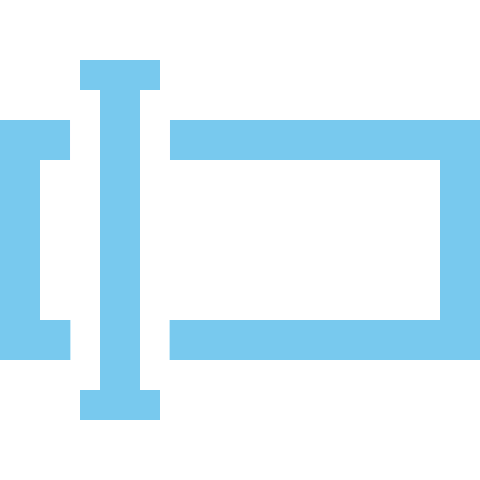
:example-caption!:

The following documents the options and features included in the VR Avatar Utils
({abbr-vau}) Blender addon.

== Armature Operations

=== Bone Rotation Mode Normalization

Normalizes the transform rotation mode on all bones in an armature to the chosen
mode value without changing the rotations of the affected bones.

[TIP]
--
Why?::
When applying poses from assets or from other armatures, having bones with
conflicting rotation modes can lead to the pose being applied incorrectly.
+
Frequently when an avatar base has a small number of bones with a different
rotation mode than the rest, it was unintentional.
--

.Base UI
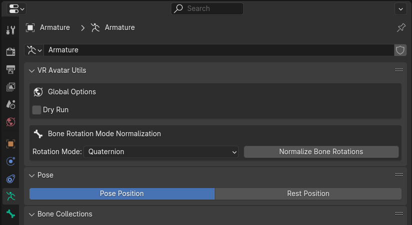

==== Options

[%collapsible%open]
.Global Options
====

[.option]
.{icon-checkbox} Dry Run
--
Sets whether the addon should perform a dry run on execution.  This means, when
enabled, that the addon will not actually change anything and will instead
report the changes that it wanted to make.

It is recommended that operations are first performed with Dry Run enabled to
ensure that all the changes that would be made are desired.
--
====

[%collapsible%open]
.Feature Options
====
[.option]
.{icon-dropdown} Rotation Mode
--
Chooses the rotation mode that will be set on all the bones in the armature.

These options align with the modes outlined in
https://docs.blender.org/manual/en/latest/advanced/appendices/rotations.html[the Blender documentation].
--
====

==== Screenshots

[.image]
[%collapsible]
.Rotation Mode Options
====
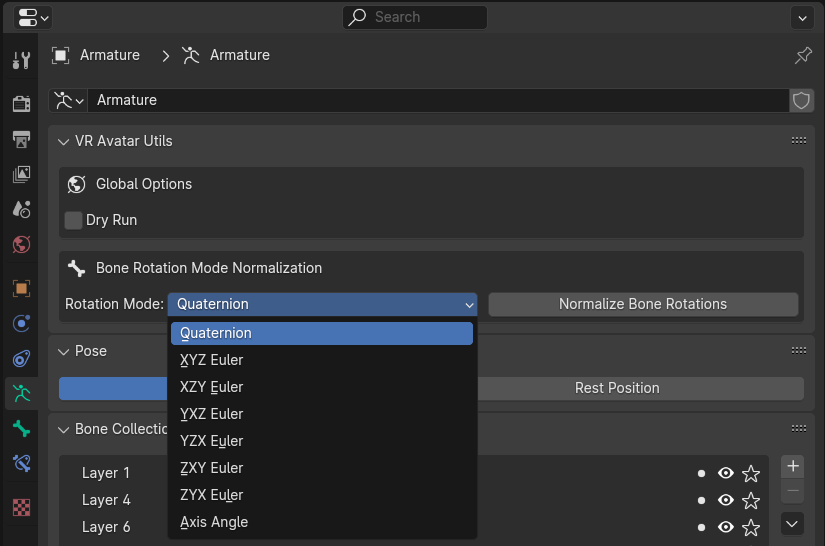
====

[%collapsible]
.Dry Run Results
====
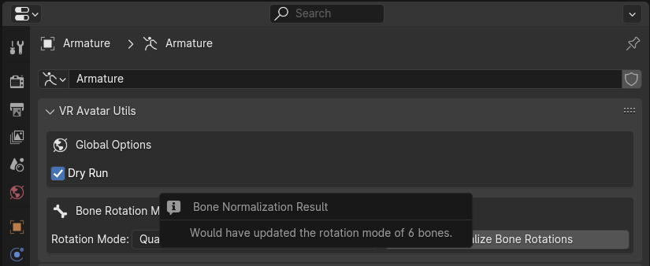
====

[%collapsible]
.Live Run Results
====
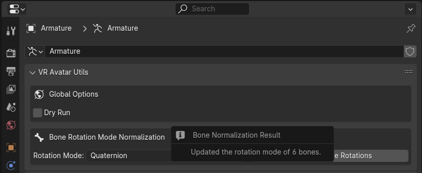
====

== Mesh Operations

.Mesh Operation Panel
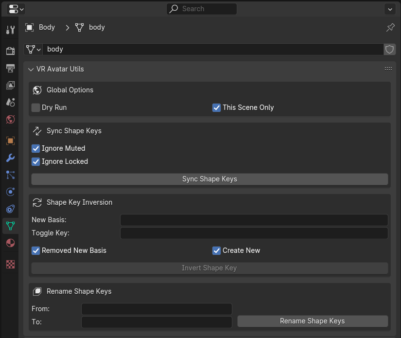

=== Cross-Object Shape Key Sync

Synchronizes the values of shape keys from the source mesh object to matching
shape keys on all other mesh objects in the scene or file.

Shape keys are matched on name, meaning only shape keys with a name matching a
shape key on the source object will be updated on a target object.  This
feature does not add or remove shape keys.

[TIP]
--
Why?::
This may come in handy while working on accessories for an avatar base that have
shape keys to match morphs available on the base.  For example, when creating a
shirt for an avatar that has height/weight options, this enables easily updating
the accessory to match those morphs on the base.

Can't you use drivers for this?::
You can, however, I have found that the time and effort cost of setting up
drivers outweighs the benefit for small scale work such as modding an avatar.
--

==== Options

[%collapsible%open]
.Global Options
====
[.option]
.{icon-checkbox} Dry Run
--
Sets whether the addon should perform a dry run on execution.  This means,
when enabled, that the addon will not actually change anything and will instead
report the changes that it wanted to make.

It is recommended that operations are first performed with Dry Run enabled to
ensure that all the changes that would be made are desired.
--

[.option]
.{icon-checkbox} This Scene Only
--
Sets whether the shape key synchronization should only apply to mesh objects in
the current scene, or all mesh objects in the file.
--
====

[%collapsible%open]
.Feature Options
====
[.option]
.{icon-checkbox} Ignore Muted
--
Sets whether the addon should ignore shape keys on the source object that are
marked as muted.
--

[.option]
.{icon-checkbox} Ignore Locked
--
Sets whether the addon should ignore shape keys on target mesh object that are
marked as locked.
--
====

[IMPORTANT]
The options outlined in the Feature Options above differ from the options
present when the {link-skp} addon is also installed and enabled.  See the
<<key-sync-integration-skp,Integrations>> section below for information about
the options specific to Shape Keys+.

==== Screenshots

[%collapsible]
.Dry Run Results
====
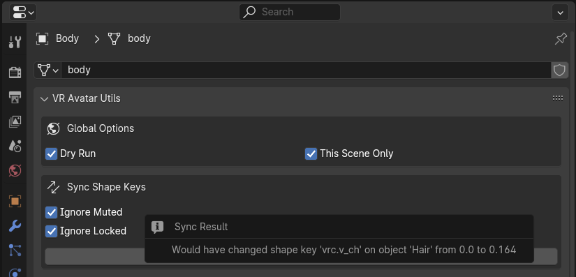
====

[%collapsible]
.Live Run Results
====
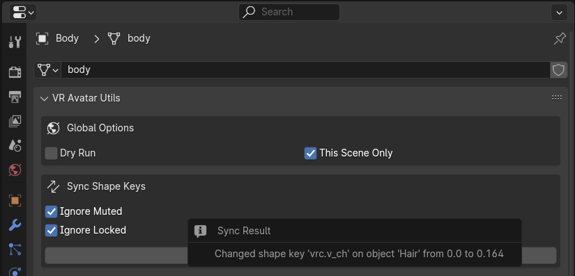
====

=== Shape Key Inversion

"Inverts" a target shape key by making its value the new basis and creating a
new toggle key which can be used to return the mesh to its former basis or some
other shape.

[TIP]
--
Why?::
When merging objects for avatar accessories into a singular mesh it is common
to use shape keys as 'toggles' for those accessories.  In this situation it is
desirable to have the basis for those objects to be a hidden state with the
toggle shape key returning the accessory to its 'normal' state.
--

To enable updating or reworking objects with existing toggles, selecting a
toggle key that already exists on the object will keep that toggle value rather
than using the original basis as the toggle value.

As a special case, when the value of 'New Basis' and 'Toggle Key' are the same,
the value of the target key **will not** become the value of the 'new' toggle
key.  The existing key will be replaced with a new key of the same name whose
shape is the former shape of the target object's basis.

.Basic Demonstration
// video::4IkBFzpjTkM[youtube,width=970,height=540,align=center]

==== Options

[%collapsible%open]
.Global Options
====
[.option]
.{icon-checkbox}Dry Run
--
Sets whether the addon should perform a dry run on execution. This means, when
enabled, that the addon will not actually change anything and will instead
report the changes that it wanted to make.
--

[.option]
.{icon-checkbox} This Scene Only
--
Has no impact on shape key inversion.
--
====

[%collapsible%open]
.Feature Options
====

[.option]
.{icon-textinput} New Basis
--
Sets the name of the key whose shape will become the new basis for the target
mesh.

The value of this option must be the name of a shape key that exists on the
target object.
--

[.option]
.{icon-textinput} Toggle Key
--
*Type*: Text Input

While this field will offer suggestions for existing shape key names, any value
may be used.

If the input value is the name of a currently existing shape key, that shape key
will become the value of the toggle.

If the input value does not match the name of any existing shape keys, the
current basis will become the value of the toggle.

If the input is left blank, a key name will be generated with the pattern
`toggle.\{new-basis-key-name}`, e.g. `toggle.some-key`.
--

[.option]
.{icon-checkbox} Remove 'New Basis'
--
When enabled, removes the key selected in the 'New Basis' field upon successful
inversion of that shape key.
--

[.option]
.{icon-checkbox} Create New Object
--
When enabled, the plugin will create a new object to operate on, leaving the
original mesh object untouched.

This option is recommended until users are comfortable with this operation and
its effects.
--
====

==== Screenshots

[%collapsible]
.New Basis Key Selection
====
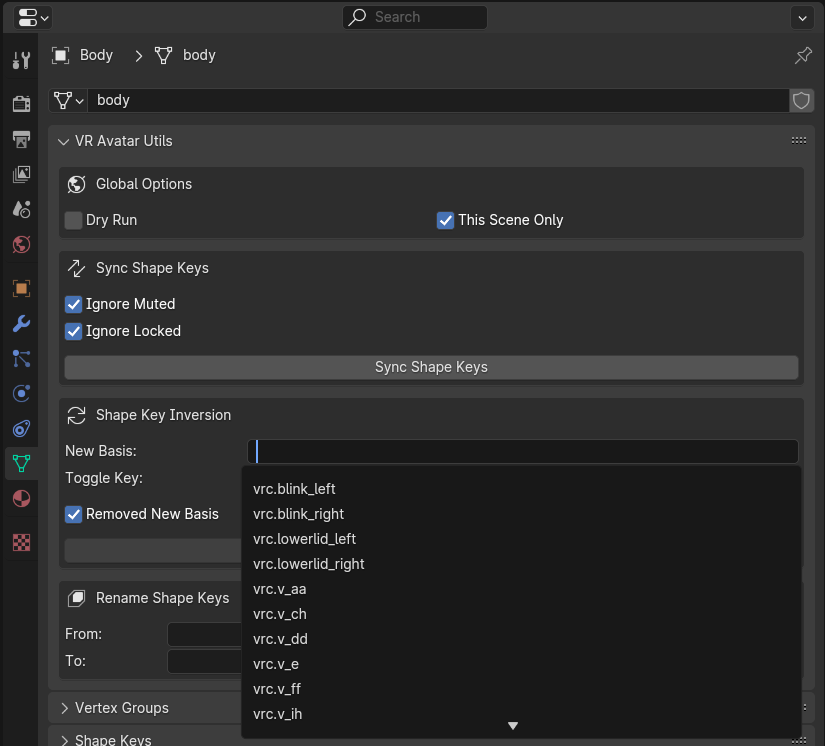
====

[%collapsible]
.Set Toggle Key Name
====
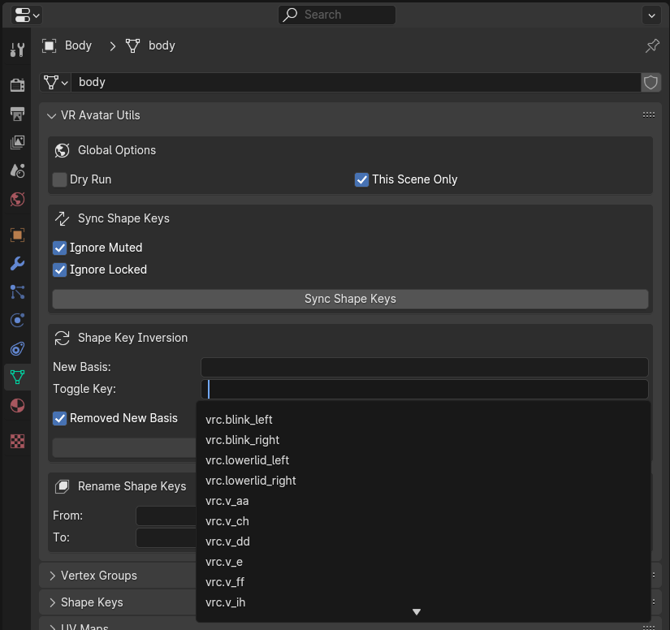
====

[%collapsible]
.Dry Run Result
====
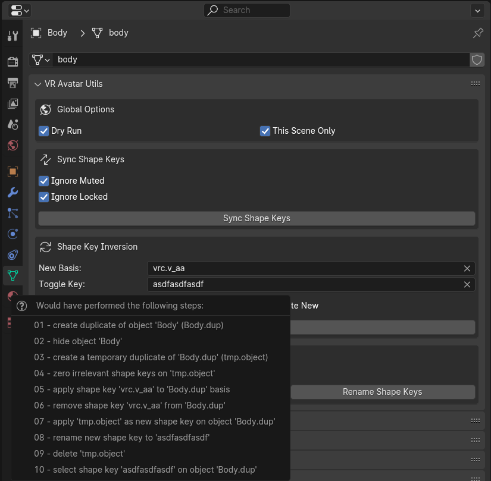
====

[%collapsible]
.Live Run Result
====
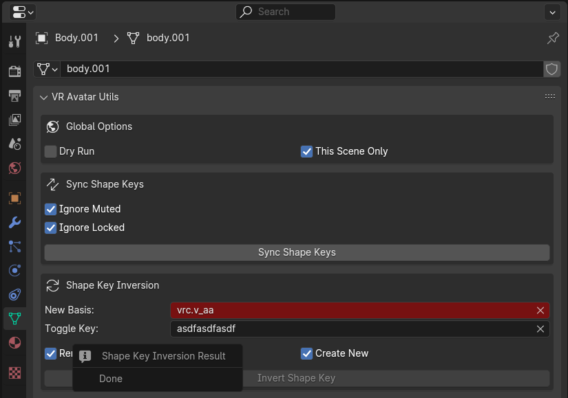
====

=== Shape Key Bulk Renaming

Renames shape keys on all mesh objects in the scene or blend file that have a
name that is an exact match for the set 'From' value.

==== Options

[%collapsible%open]
.Global Options
====
[.option]
.{icon-checkbox} Dry Run
--
| Sets whether the addon should perform a dry run on execution.  This means,
when enabled, that the addon will not actually change anything and will instead
report the changes that it wanted to make.

It is recommended that operations are first performed with Dry Run enabled to
ensure that all the changes that would be made are desired.
--

[.option]
.{icon-checkbox} This Scene Only
--
Sets whether the shape key renaming should only apply to mesh objects in the
current scene, or all mesh objects in the file.
--
====

[%collapsible%open]
.Feature Options
====
[.option]
.{icon-textinput} From
--
Sets the target shape key name that will be replaced with the value of the 'To'
field on all objects in the scene or blend file.

This field is locked to only the names of shape keys on the currently selected
object mesh.
--

[.option]
.{icon-textinput} To
--
Sets whether the addon should ignore shape keys on target mesh object that are
marked as locked.
--
====

[NOTE]
--
If a name conflict is found on any of the relevant mesh objects, the action will
be aborted without making any changes.
--

==== Screenshots

[%collapsible]
.Source Name Selection
====
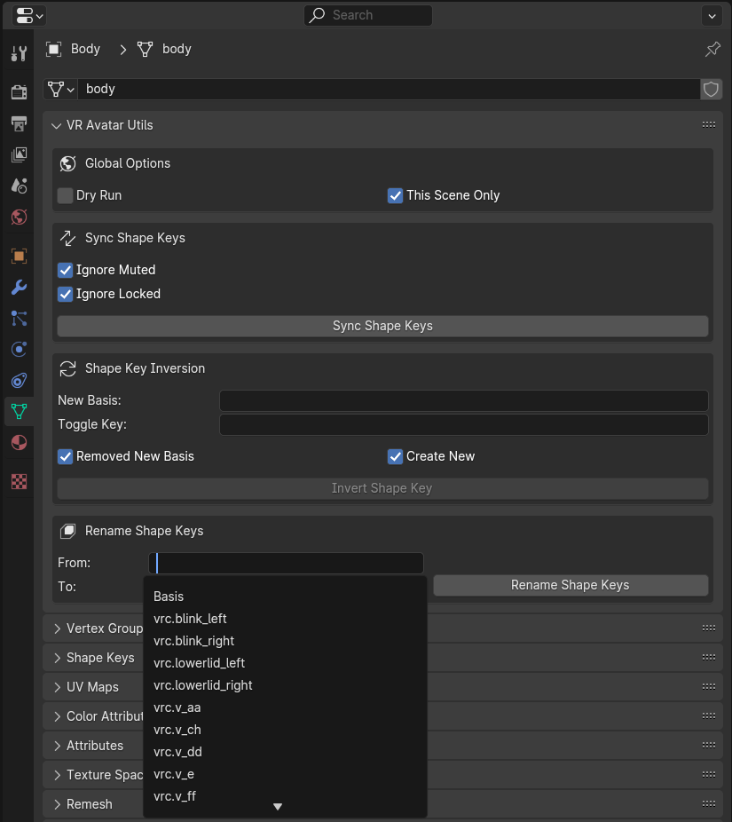
====

[%collapsible]
.Dry Run Result
====
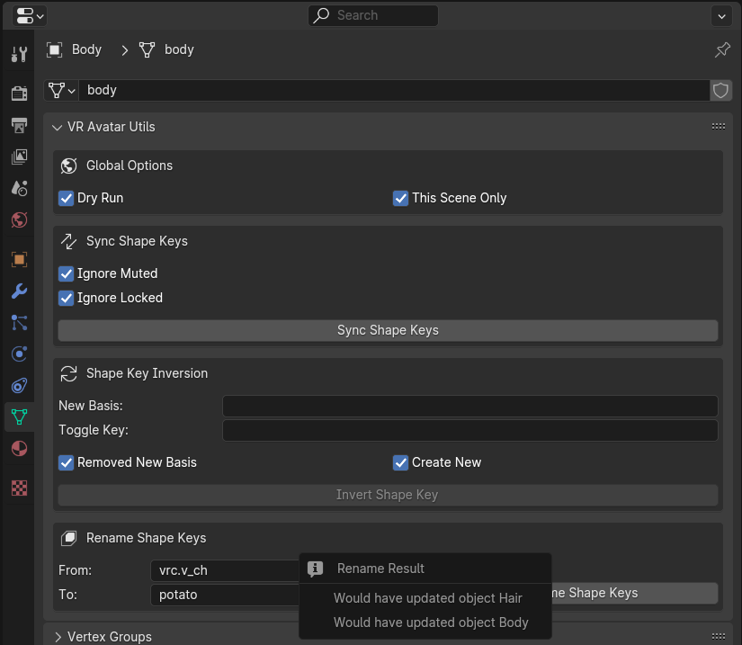
====

[%collapsible]
.Live Run Result
====
image::img/sk-rename-3.png[align=center]
====

[%collapsible]
.Name Conflict
====
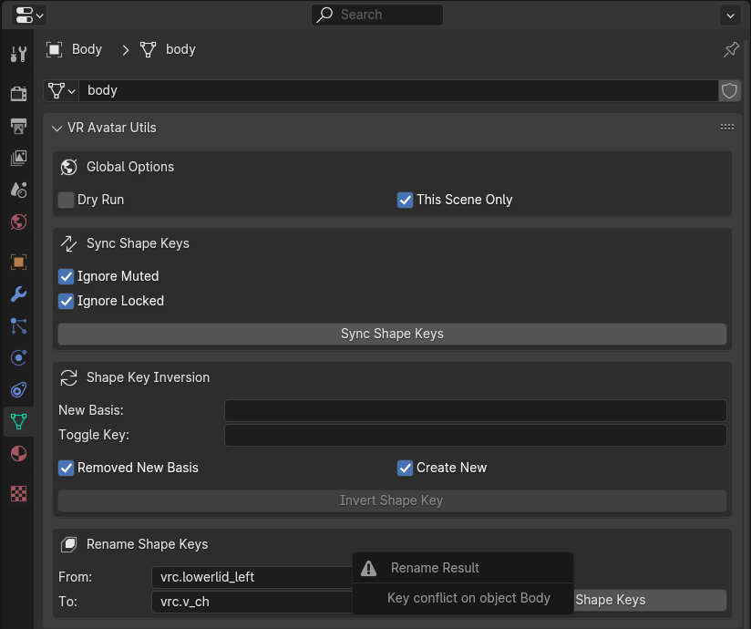
====

[#key-sync-integrations]
== Integrations

[#key-sync-integration-skp]
=== Shape Keys+

When the {link-skp} addon is also installed and enabled, {abbr-vau} will offer
different options for synchronizing shape keys.  As the Shape Keys+ addon hides
the ability to toggle shape key locking and adds the ability to select shape
keys or folders of shape keys, the 'Ignore Locked' option will be replaced with
2 new options, 'Only from Selected' and 'Only to Selected' which control which
shape keys are synced from the source object to target objects.

==== Shape Key Value Synchronization

[%collapsible%open]
.Global Options
====
[.option]
.{icon-checkbox} Dry Run
--
Sets whether the addon should perform a dry run on execution.  This means,
when enabled, that the addon will not actually change anything and will instead
report the changes that it wanted to make.

It is recommended that operations are first performed with Dry Run enabled to
ensure that all the changes that would be made are desired.
--

[.option]
.{icon-checkbox} This Scene Only
--
Sets whether the shape key synchronization should only apply to mesh objects
in the current scene, or all mesh objects in the file.
--
====

[%collapsible%open]
.Feature Options
====
[%header, cols='2,1,7']
[.option]
.{icon-checkbox} Ignore Muted
--
Sets whether the addon should ignore shape keys on the source object that are
marked as muted.
--

[.option]
.{icon-checkbox} Only from Selected
--
Sets whether the addon should only attempt to sync values from keys that have
been selected on the source object via the Shape Keys+ panel.
--

[.option]
.{icon-checkbox} Only to Selected
--
Sets whether the addon should only attempt to sync value to keys that have been
selected on target objects via the Shape Keys+ panel.
--
====

==== Screenshots

[%collapsible]
.Shape Keys+ Options
====
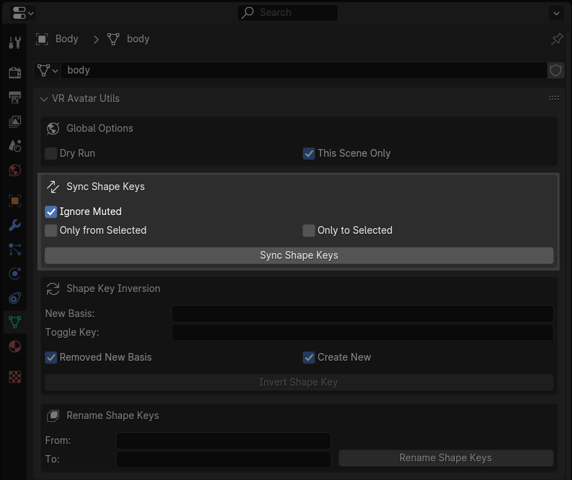
====
